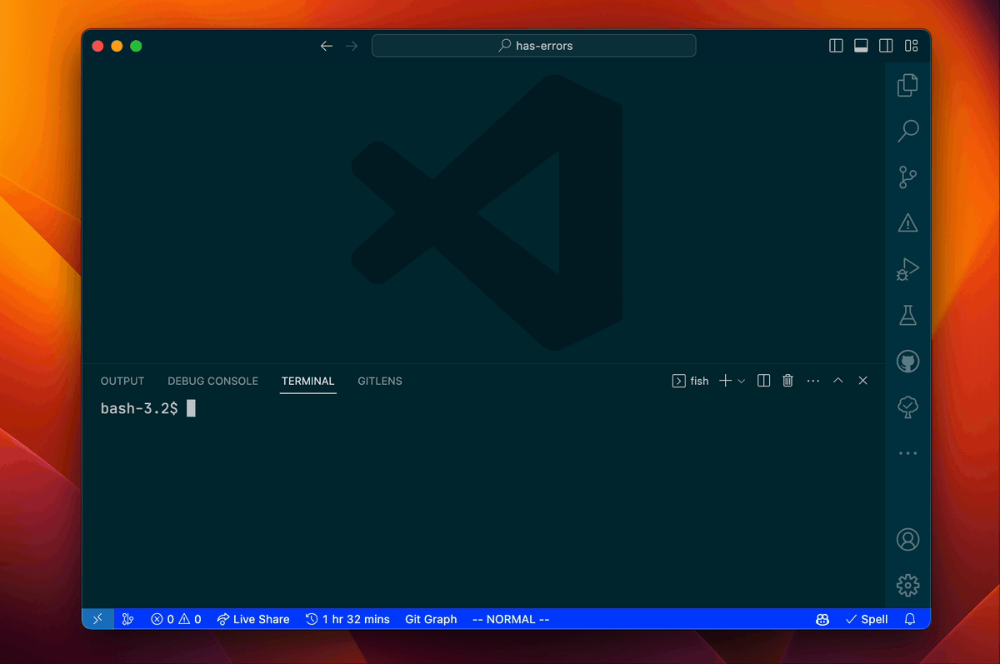

# ts-error-files

A CLI tool for listing TypeScript files where errors have occurred.

## Installation

```sh
npm install --global ts-error-files
```

## Usage

### Open all files with errors in VSCode

```sh
code $(ts-error-files)
```



### Print a list of files where errors have occurred

```sh
ts-error-files
```
